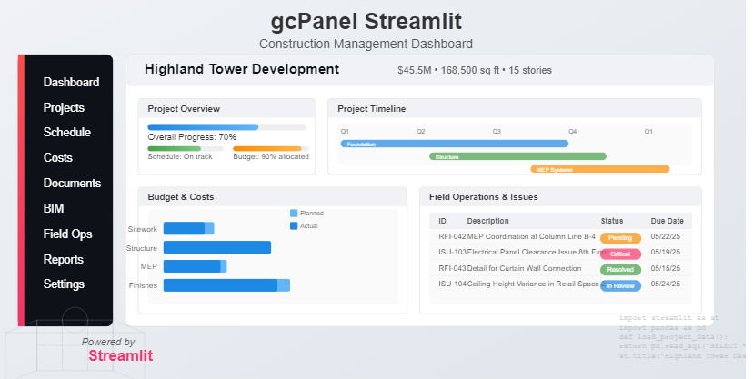

# gcPanel - Construction Management Dashboard

A comprehensive construction project management platform built with Streamlit, designed for modern construction teams who need powerful project management capabilities with an intuitive interface.

## 🏗️ Project Overview

**Highland Tower Development** - A $45.5M mixed-use development showcasing the full capabilities of gcPanel's construction management platform.

- **120 residential units + 8 retail spaces**
- **168,500 sq ft across 15 stories above ground + 2 below**
- **Complete project lifecycle management from preconstruction to closeout**

## ✨ Key Features

gcPanel revolutionizes construction project management with enterprise-grade features in a user-friendly interface:

### 📊 Core Management Modules
- **🎯 Dashboard**: Real-time project KPIs, budget tracking, and progress visualization
- **📅 Schedule Management**: Interactive Gantt charts and milestone tracking
- **💰 Cost Management**: Budget control, change orders, T&M tickets, and AIA billing
- **⚠️ Safety Management**: Incident tracking, compliance monitoring, and safety metrics
- **📋 Field Operations**: Daily reports, quality control, and issue management
- **📑 Contract Management**: Contract tracking, procurement, and vendor management
- **🏗️ BIM Integration**: 3D model visualization and clash detection
- **📄 Document Control**: Drawing management, RFIs, and specification tracking
- **🔧 Engineering**: Technical calculations, specifications, and design management
- **✅ Project Closeout**: Warranty tracking, final documentation, and handover

### 🔐 Security & Authentication
- **Production-ready login system** with rate limiting and security features
- **Role-based access control** for different user types (Admin, PM, Field, Subcontractor, Client)
- **Digital signatures** integrated into forms for T&M tickets, change orders, and invoices
- **Session management** with secure JWT token handling

### 🎨 User Experience
- **Modern, clean interface** without sidebars for maximum screen real estate
- **Responsive design** optimized for both desktop and mobile field use
- **Professional styling** with consistent UI components across all modules
- **Streamlined workflows** designed for construction industry best practices

## 🚀 Quick Start

### Prerequisites
- Python 3.8+
- Streamlit 1.24+
- PostgreSQL database (or use demo data)

### Installation
1. **Clone the repository**
2. **Install dependencies** using the provided package management
3. **Set up environment variables** for database connection
4. **Run the application**: `streamlit run app.py --server.port 5000`

### Demo Login Accounts
The system includes pre-configured demo accounts for testing different user roles:
- **Admin**: Full system access and configuration
- **Project Manager**: Project oversight and reporting
- **Field Supervisor**: Daily operations and field reports  
- **Subcontractor**: Limited access to relevant work items
- **Client**: Read-only access to project status and reports

## Developer Guide

### Project Structure

```
gcPanel/
├── app.py                 # Main application entry point
├── app_manager.py         # Application initialization and module routing
├── app_config.py          # Centralized configuration settings
├── assets/                # Static assets (CSS, images, etc.)
│   ├── container_styles.py    # UI container styling
│   └── styles.py              # Global CSS styles
├── components/            # Reusable UI components
│   ├── action_bar.py          # Action buttons for pages
│   ├── header_clean.py        # Application header
│   └── ...                    # Other components
├── core/                  # Core application services
├── data/                  # Data models and database utilities
├── modules/               # Application modules/pages
│   ├── dashboard/             # Dashboard module
│   ├── contracts/             # Contracts module
│   └── ...                    # Other modules
├── utils/                 # Utility functions and helpers
│   ├── ui_manager.py          # UI utility functions
│   └── ...                    # Other utilities
├── static/                # Static assets served by the application
└── tests/                 # Unit and integration tests
```

### Application Architecture

The gcPanel application follows a modular architecture with the following key components:

1. **Entry Point (app.py)**: Initializes the application and starts the main workflow.

2. **Application Manager (app_manager.py)**: Handles session state, navigation, and module routing.

3. **Configuration (app_config.py)**: Centralized settings organized by functional areas.

4. **Components**: Reusable UI elements that maintain consistent design throughout the app.

5. **Modules**: Individual functional areas of the application (Dashboard, Contracts, etc.).

### How to Extend the Application

#### Adding a New Module

1. **Create Module Directory**: Create a new directory in the `modules/` folder for your module:
   ```
   modules/new_module/
   ```

2. **Create Module Files**:
   ```python
   # modules/new_module/__init__.py
   import streamlit as st
   
   def render_new_module():
       st.title("New Module")
       # Your module content here
   ```

3. **Update Configuration**: Add your module to `app_config.py`:
   ```python
   # Add to MENU_OPTIONS
   MENU_OPTIONS = [
       # ... existing options
       "🆕 New Module",
   ]
   
   # Add to MENU_MAP
   MENU_MAP = {
       # ... existing mapping
       "🆕 New Module": "New Module",
   }
   
   # If your module needs action buttons
   PAGES_WITH_ACTIONS = {
       # ... existing pages
       "New Module": "New Item",
   }
   ```

4. **Register Module Renderer**: Add your module to the rendering function in `app_manager.py`:
   ```python
   # Import your module
   from modules.new_module import render_new_module
   
   # Add to module_mapping in render_selected_module
   module_mapping = {
       # ... existing modules
       "New Module": render_new_module,
   }
   ```

#### Creating New Components

1. **Create Component File**: Add a new file in the `components/` directory:
   ```python
   # components/new_component.py
   import streamlit as st
   
   def render_new_component(param1, param2=None):
       """
       Render a new component.
       
       Args:
           param1: First parameter description
           param2: Optional second parameter description
       
       Returns:
           Any data that needs to be returned
       """
       # Component implementation
       pass
   ```

2. **Import and Use**: Import and use your component in modules:
   ```python
   from components.new_component import render_new_component
   
   # In your module
   render_new_component("some value")
   ```

### Best Practices

1. **Modular Design**: Keep modules and components focused on specific functionality.

2. **Consistent Styling**: Use the provided styling utilities in `assets/` for UI consistency.

3. **Clean Imports**: Import only what you need to avoid circular dependencies.

4. **Documentation**: Add docstrings to all functions and modules explaining purpose and usage.

5. **Session State**: Use Streamlit's session state for storing persistent data between reruns.

6. **Configuration**: Add new configuration values to appropriate sections in `app_config.py`.

## Modules

| Module | Description |
|--------|-------------|
| **Dashboard** | Project overview with key metrics and analytics |
| **Project Information** | Central repository for project details and team information |
| **Schedule** | Gantt charts, milestone tracking, and progress visualization |
| **Safety** | Incident reports, safety metrics, and compliance tracking |
| **Contracts** | Contract management, change orders, and procurement |
| **Cost Management** | Budget tracking, forecasting, and financial reporting |
| **Engineering** | Technical documentation, specifications, and calculations |
| **Field Operations** | Daily reports, quality control, and issue tracking |
| **Documents** | Document management with version control and approval workflows |
| **BIM** | 3D model visualization and information extraction |
| **Closeout** | Project closeout documentation and warranty management |

## Implementation

### Installation Requirements
- Python 3.8+
- Streamlit 1.24+
- SQLAlchemy
- Plotly and Pandas for data visualization
- JWT for authentication

### Database Configuration
The platform supports both SQLite (local development) and PostgreSQL (production) databases through SQLAlchemy ORM.

### Authentication
Role-based access control with secure JWT implementation supports multiple user types:
- Administrator
- Project Manager
- Field Supervisor
- Subcontractor
- Client/Owner

## 🛠️ Technical Architecture

### Application Structure
```
gcPanel/
├── app.py                     # Main application entry point
├── login_form.py             # Secure authentication system
├── app_manager.py            # Session management and routing
├── app_config.py             # Centralized configuration
├── modules/                  # Feature modules
│   ├── dashboard/           # Project overview and KPIs
│   ├── cost_management/     # Budget, billing, change orders
│   ├── field_operations/    # Daily reports, inspections
│   ├── safety/             # Safety management and incidents
│   └── contracts/          # Contract and vendor management
├── components/              # Reusable UI components
│   ├── digital_signature.py # Digital signature integration
│   └── header_clean.py     # Application header
├── assets/                 # Styling and UI enhancements
├── utils/                  # Utility functions and helpers
└── data/                   # Data storage and models
```

### Key Design Principles
- **Modular Architecture**: Each module is self-contained and easily extensible
- **Consistent UI/UX**: Standardized components ensure uniform experience
- **Security First**: Production-ready authentication and data protection
- **Mobile Responsive**: Optimized for field use on tablets and phones
- **Performance Optimized**: Efficient data handling and caching strategies

## 📈 Recent Updates

### Latest Improvements
- ✅ **Removed sidebar navigation** for cleaner, full-width interface
- ✅ **Enhanced login system** with security features and demo accounts
- ✅ **Digital signatures** integrated into critical forms
- ✅ **Improved error handling** and code quality across modules
- ✅ **Streamlined UI** with professional styling and consistent layouts
- ✅ **Database optimization** for better performance

### Currently Active Features
- **Complete Cost Management** with T&M tickets, change orders, and AIA billing
- **Field Operations** with daily reports and quality control tracking
- **Safety Management** with incident reporting and compliance tracking
- **Document Management** with version control and approval workflows
- **BIM Integration** with 3D model visualization capabilities

## 🔮 Future Enhancements

- **Advanced Analytics**: Predictive project insights and risk assessment
- **Mobile App**: Native companion for field data collection
- **API Integration**: Enhanced connectivity with external construction tools
- **Multi-Project**: Portfolio management across multiple projects
- **AI Features**: Automated report generation and intelligent recommendations

## 📸 Screenshots


*gcPanel Construction Management Dashboard - Highland Tower Project Overview*

## 📄 License

© 2025 gcPanel Construction Management Platform. All rights reserved.